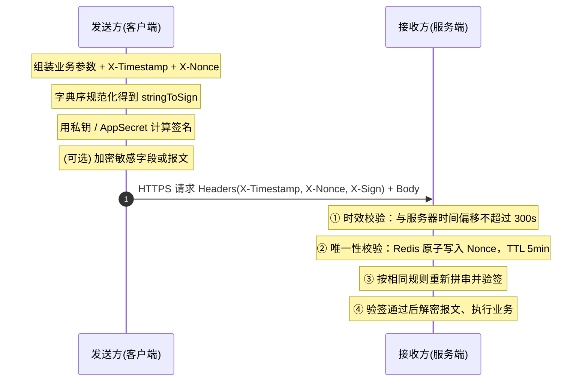
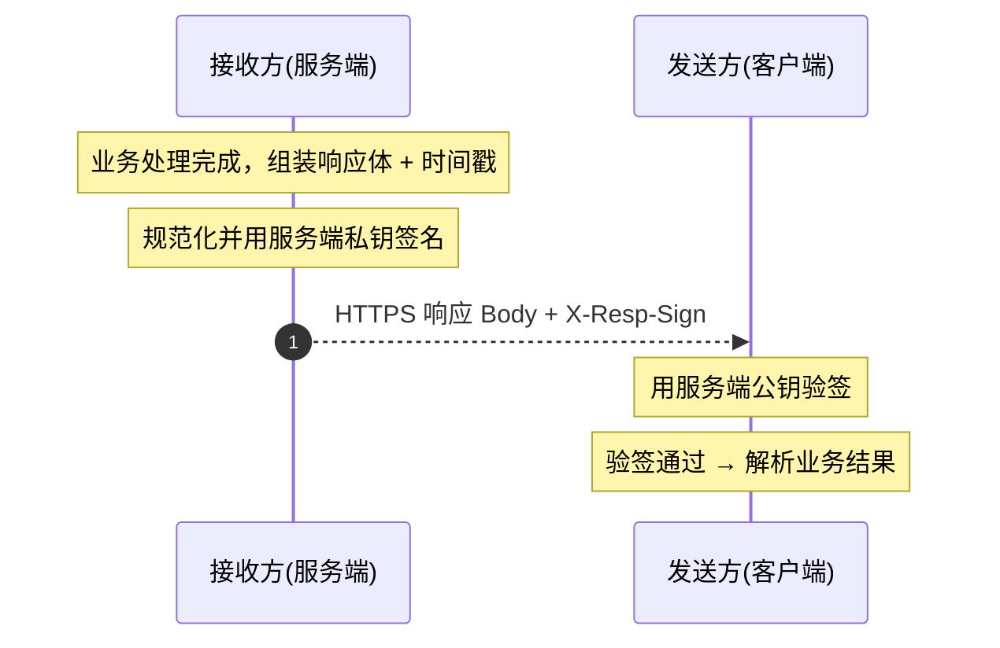

三方交互的本质，是把数据丢进一条你掌控不了的网络，交给一个必须确信“这确实是你发的、中途没被动过”的系统。

HTTPS 只加密传输管道本身——挡得住窃听，挡不住把一段合法报文原样重放，更证明不了应用层面的身份。管道之外，应用层得自己把四件事补齐：**机密性、完整性、身份认证、不可否认性**。整套方案的每一个环节，都是在加固其中一项。

<!-- truncate -->

## 威胁场景

不谈威胁谈机制都是空中楼阁。三方交互要对抗的攻击就这几类，每一类都有明确的对应防御：

| 威胁 | 攻击方式 | 对应防御 |
| :--- | :--- | :--- |
| 窃听 | 抓包读取链路上的明文 | TLS 传输加密 + 报文级 AES 加密 |
| 篡改 | 修改请求 / 响应内容 | 数字签名，验签失败即拒 |
| 重放 | 截获合法报文原样重新提交 | Timestamp 时效窗口 + Nonce 去重 |
| 身份伪造 | 冒充合法调用方发请求 | 签名私钥 / AppSecret + 证书绑定 |
| 中间人 | 劫持链路双向代理 | TLS 证书校验 + 证书固定（pinning） |

一个常见误区要分清：**签名防篡改不防窃听，加密防窃听不防篡改**，两者互补，缺一不可：

- 只签名不加密，攻击者看得到全部明文
- 只加密不签名，攻击者改一个字节你解密失败却无法归责

## 四项核心机制

行业方案几乎都由下面四项技术组合而成，没有银弹，是分层叠加：

| 安全机制 | 技术实现 | 核心目的 | 说明 |
| :--- | :--- | :--- | :--- |
| **传输层安全** | HTTPS / TLS | 防链路监听与篡改 | 基础保障，所有报文在网络层加密。 |
| **数字签名** | RSA / ECDSA（非对称）与 HMAC-SHA256（对称） | 防篡改、身份确认、不可否认 | 非对称：发送方私钥签名，接收方公钥验签。<br/>对称：双方共享 AppSecret 算 HMAC。 |
| **防重放** | Timestamp + Nonce | 防合法请求被截获后二次提交 | Timestamp 限定时效，Nonce 配合缓存去重。 |
| **报文加密** | AES（对称）、RSA + AES（混合） | 保护机密性 | 仅对整包或身份证、银行卡等敏感字段加密。 |

## 签名算法怎么选

签名算法分两派，选型直接决定密钥分发方式和归责能力。

**安全基础不同**

非对称签名（RSA / ECDSA）的安全性建立在数学难题上：RSA 依赖大整数分解，ECDSA 依赖椭圆曲线离散对数（ECDLP），私钥不参与网络传输，泄露面小。

HMAC 的安全性则建立在哈希函数（SHA-256）的抗碰撞性加密钥保密性上——AppSecret 一旦泄露，任何人都能伪造出合法签名。

**本质差异在不可否认性**

非对称签名只有私钥持有者能产生，纠纷时可单方归责、可审计；

HMAC 双方共享同一密钥、都能算出完全相同的签名，无法证明这条签名究竟是谁发的，天然不具不可否认性。涉及资金、合同、合规归责的场景，这一项就足以否掉对称方案。

就安全强度而言，RSA-2048 ≈ 112-bit、RSA-3072 ≈ 128-bit、ECDSA P-256 ≈ 128-bit，且 ECDSA 的密钥与签名都更短，同等安全强度下性能更好。

| 维度 | 非对称（RSA / ECDSA） | 对称（HMAC-SHA256） |
| :--- | :--- | :--- |
| 安全基础 | 数学难题（分解 / ECDLP） | 哈希抗碰撞 + 密钥保密 |
| 密钥形态 | 公私钥分离，公钥可公开 | 双方共享同一 AppSecret |
| 密钥泄露面 | 私钥单点持有，泄露面小 | 双方均持有，泄露面大 |
| 不可否认性 | 私钥唯一可签，可归责 | 双方都能签，无法归责 |
| 性能 | 签名 / 验签较慢 | 计算快，适合高频调用 |
| 密钥分发 | 公钥公开分发，需防调包 | AppSecret 传输与存储都是风险点 |

**适用场景**

非对称面向不可信第三方的开放场景（如开放平台），尤其是金融、安全领域。

对称面向可信内部点对点：同一组织的微服务间、企业内部 API、性能敏感的高频调用——双方都信任且不需要事后归责，用 HMAC 换取更低开销。

**主流推荐**

对外开放平台选 `ECDSA P-256` 或 `RSA-2048`。RSA 优先 RSASSA-PSS（比 PKCS#1 v1.5 更抗填充攻击），ECDSA 密钥与签名更短、速度更快，是新平台的首选。

内部高频通道选 HMAC-SHA256，配合严格的密钥管理与定期轮换。

行业里两类都常见，但是无论选哪种，RSA-1024 及以下、MD5、SHA-1 等应一律禁用。

## 标准请求与验签流程

主流开放平台（如支付）的请求交互，本质都是同一套流程：



## 报文加密怎么选

签名解决“防不防改”，加密解决“看不看得到”，各管一摊。加密只保证机密性、**不提供完整性**——密文被改一位，你只是解密失败，证明不了是谁动的。所以要么加密之外再签名，要么直接用带认证的加密模式（AEAD，如 AES-GCM），把机密性和完整性一次性都给上。

常见三种做法：

| 方式 | 机制 | 优点 | 缺点 | 适用 |
| :--- | :--- | :--- | :--- | :--- |
| 对称 AES | 双方共享 AES 密钥 | 速度快，适合大报文 / 批量数据 | 密钥分发与保管是风险点，静态密钥泄露后历史密文皆可解 | 已安全分发密钥、高频大数据 |
| 纯非对称 RSA | 接收方公钥加密、私钥解密 | 无需共享密钥，公钥可公开 | 慢；单次有长度上限（RSA-2048 约 245 字节），不能直接加密大报文 | 只加密小块数据，典型是加密一把 AES 密钥 |
| 混合（RSA + AES 信封） | RSA 加密一次性随机 AES 密钥，AES 加密报文 | 兼顾密钥分发便利与 AES 性能；无需长期保管静态对称密钥，每条报文独立 | 实现复杂，需管理接收方公钥 | 开放平台、对接不可信第三方，业界主流 |

**选型**

对外开放平台优先混合加密：随机生成一次性 AES 密钥加密报文，再用接收方公钥加密这把密钥一起发出，接收方拿私钥解出密钥再解报文。

纯 RSA 只用来加密小块数据（如那把 AES 密钥）；如果内部已建立密钥分发的通道，直接用 AES 更省事。

无论哪种，算法至少 AES-128，模式选 GCM（自带认证）或 CBC + HMAC，禁用 ECB、DES、3DES、RC4。

## 接收方校验顺序：防线要分层

接收方拿到请求后必须按固定顺序逐项校验，**任意一步失败都立即中断并返回错误**，不要把后面的活干了。顺序是有讲究的：

1. **时效校验** 先看时间戳是不是在容忍窗口内，过期直接拒。这步开销最小，挡掉绝大多数重放。
2. **唯一性校验** 把 `X-Nonce` 写进缓存做去重，命中即判定重放。
3. **验签** 时效和去重都过了，才值得花 CPU 重新拼串、做非对称验签或 HMAC。
4. **解密与业务处理** 验签通过才解密，明文进业务逻辑。

**先验签后解密**这一点容易被写反。若先解密再验签，攻击者用一个伪造密文就能逼服务端白白消耗解密算力，甚至诱发 Padding Oracle 类漏洞。正确的顺序是“先验证来源合法性，再动数据”。

## 响应也要签名

请求做了签名，响应同样必须签名。否则攻击者改不了请求，却能在响应回程上篡改数据——客户端拿到的“支付成功”可能是被中间人改过的。响应签名是对称的镜像流程：



请求由发送方签名、接收方用发送方公钥验；响应由接收方签名、发送方用接收方公钥验。两把不同的私钥，方向别搞反。

## 签名规范化（Canonicalization）

验签失败最常见的原因，不是算法用错，而是双方拼出的待签名串不一致。规范化逻辑必须逐字对齐：

1. **参数提取**。取所有 Header 关键字段（`X-Timestamp`、`X-Nonce`）及 Query / Body 参数，剔除空值字段和 `sign` 本身。
2. **字典序排序**。按参数名的 ASCII 码升序排。
3. **拼接待签名串**。用 `key=value`、`&` 连接，`body` 整体作为一个值。
4. **计算签名**。

最终拼出的 `stringToSign` 长这样（`body` 整体参与，按 key 字典序）：

```text
appId=DEMO001&body={"orderId":"123"}&nonce=8f1c2b7e&timestamp=1774167195
```

两种算法的输出：

```text
RSA/ECDSA :sign = Base64(RSA_SHA256(privateKey, stringToSign))   # 接收方用公钥验
HMAC      :sign = HexLower(HMAC_SHA256(appSecret, stringToSign)) # 双方共享密钥
```

以 HMAC 签名为例，Java 侧的核心实现，`TreeMap` 直接保证 key 字典序：

```java
// 参与签名的参数，剔除空值与 sign 本身
Map<String, String> params = new TreeMap<>();         // TreeMap 按 key 自然排序
params.put("appId",     "DEMO001");
params.put("body",      bodyJson);
params.put("nonce",     nonce);
params.put("timestamp", String.valueOf(timestamp));

// 拼成 appId=..&body=..&nonce=..&timestamp=..
String stringToSign = params.entrySet().stream()
        .map(e -> e.getKey() + "=" + e.getValue())
        .collect(Collectors.joining("&"));

// HMAC-SHA256 → 小写 hex
Mac mac = Mac.getInstance("HmacSHA256");
mac.init(new SecretKeySpec(appSecret.getBytes(UTF_8), "HmacSHA256"));
String sign = HexFormat.of().formatHex(mac.doFinal(stringToSign.getBytes(UTF_8)));
```

拼接规则的所有细节——`body` 是否做 URL 编码、分隔符、大小写、空值是否参与——双方必须在文档里逐条写死，**一个字符不一致验签就挂**。

## 防重放的工程实现

防重放靠 Timestamp 和 Nonce 双保险，缺一个都有漏洞。

**Timestamp 限定时效。** 服务器收到请求时算时间差，超过容忍窗口直接拒：

$$
\text{有效} \iff \left| t_{\text{server}} - t_{\text{req}} \right| \le \Delta t, \quad \Delta t = 300\text{s}
$$

窗口一般取 5 分钟，要略大于“客户端到服务端网络延迟 + 双方时钟可能存在的偏差”。

**Nonce 保证唯一。** 时间戳只挡“过期重放”，挡不住“窗口内即时重放”。Nonce 是每次请求唯一的随机串，配合缓存去重。关键在写入要原子：

```text
SET nonce:<X-Nonce> 1 NX EX 300
```

用 Redis 的 `SET ... NX EX`（不存在才写，并设 5 分钟 TTL）一步完成“检查 + 记录”。返回成功说明是首次、放行；返回 `nil` 说明 nonce 已存在、判定重放、拒绝。TTL 要略大于时间戳容忍窗口，窗口外的请求反正会被时效校验挡掉，nonce 缓存也就没必要留着。

不要把“检查”和“写入”拆成两步（先 `GET` 再 `SET`），并发下两个相同请求会同时通过检查。

## 时间戳格式选型

防重放 Header 里时间戳用什么格式，直接影响接口稳定性和解析性能：

| 格式 | 示例 | 优点 | 缺点 |
| :--- | :--- | :--- | :--- |
| UNIX 时间戳 | `1774167195`(秒) 或 `1774167195000`(毫秒) | 绝对无时区歧义；纯数值比较，校验开销极小；不含空格 / 时区字符，签名稳定 | 人眼不可读 |
| ISO 8601 | `2026-07-22T08:13:15Z` | 带时区，语义明确；人眼可读 | 客户端 / 服务端格式不一致（`Z` 与 `+00:00`）极易导致验签失败 |
| 无时区数字串 | `20260722081315` | 可读性尚可 | 丢失时区信息，易出 8 小时时差 Bug；字符串解析消耗 CPU |

实践上有三条：

- **防重放 Header 统一用 UNIX 时间戳**（秒级或毫秒级），如 `X-Timestamp: 1774167195`。
- **绝不参与签名**的是无时区的 `yyyyMMddHHmmss`，时差 Bug 和拼串不一致的重灾区。
- **若必须用日期字符串**，强制带 UTC 或时区偏移的 ISO 8601（如 `2026-07-22T08:13:15Z`），并在文档里写死大小写与空格规则。

## 密钥管理

机制再严密，密钥泄漏就全盘崩溃。

- **密钥分离。** 测试环境与生产环境必须用独立的密钥对和 AppSecret，测试密钥永远不能进生产。
- **私钥绝不外泄。** 非对称体系里公钥随便发，私钥只待在本地或硬件安全模块（HSM）里，不通过网络传输、不写进代码仓库、不打进镜像。
- **AppSecret 当作密码管。** 对称密钥靠安全通道下发，定期轮换，泄露即吊销重发。
- **密钥轮换。** 预留多版本公钥共存期，新签名带 `keyId`，验签按 `keyId` 选公钥，做到平滑切换。

## 常见反模式

接手过的接口安全坑，几乎都集中在这几条：

- **用 MD5 / SHA-1 算签名。** 弱哈希存在碰撞攻击，签名算法至少 SHA-256。
- **Timestamp 用无时区的 `yyyyMMddHHmmss` 参与签名。** 时差 Bug 钉子户。
- **Nonce 只校验不存储，或存了不设 TTL。** 缓存无限增长，去重形同虚设。
- **先解密后验签。** 把算力暴露给伪造请求，还可能引出 Padding Oracle。
- **响应不签名。** 请求侧严防死守，响应回程裸奔。
- **TLS 关闭证书校验。** `curl -k`、忽略主机名校验，等于把链路交给中间人。
- **密钥进日志、进 Git。** 打日志不脱敏身份证和卡号；私钥 / AppSecret 直接提交进仓库。
- **测试生产共用密钥。** 一次误操作把测试环境公钥发到生产，验签全线失败。

## 核心原则

- 强制 HTTPS，并校验证书，别关。
- 请求、响应双向签名。
- 校验短路：时效 → 唯一性 → 验签 → 解密，任一失败即拒。
- 密钥分离，私钥不出本地 / HSM。
- 日志脱敏，绝不打印私钥与密钥。
- 签名算法用 SHA-256 及以上，时间戳用 UNIX 秒。
